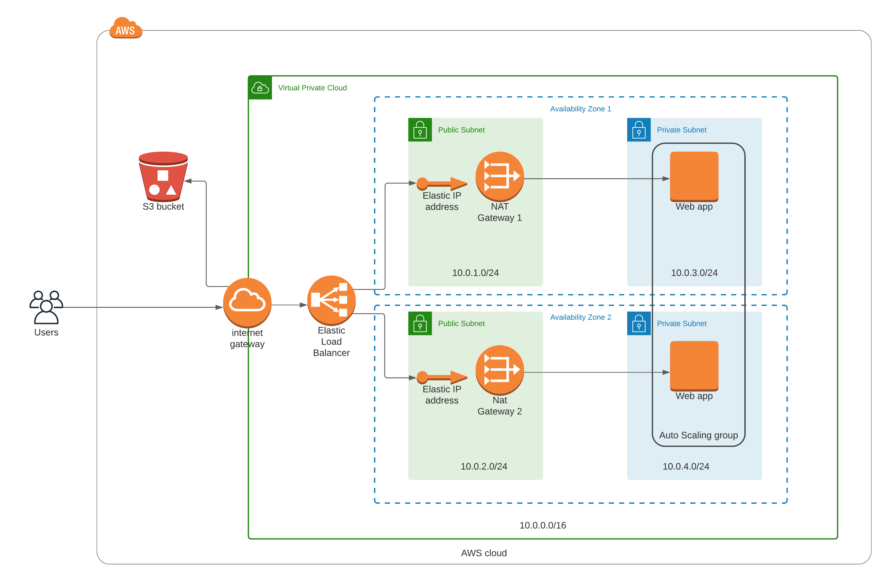

# Udagram

## Description

In this project, a web app with high availability is deployed to AWS using Cloudformation.

In this scenario, we are deploying an Apache Web Server and grabbing the JavaScript and HTML files from an S3 bucket.

## Infrastructure

To create an infrastructure with high availability, a Virtual Private Cloud with 4 subnets was created. Two of these subnets are public and the other two are private. An Auto Scaling Group was created in the private subnets, with instances with ubuntu 18, t3.medium. In these EC2 instances Apache Web server was installed, in which a static web page is being hosted. The static web page is being pulled from an S3 bucket. To allow EC2 instances to access the bucket, the relevant IAM roles were created.

The instances have access to the internet through the NAT Gateways, which in turn use an Internet Gateway. Each Nat Gateway has an Elastic IP.

At the moment, access to Instances via SSH was disabled for security reasons. It goes without saying that Security Groups were created with only the necessary rules.

An Application Load Balancer was also created, which is checking the status of the instances to know which of them needs to be replaced and to make the relevant traffic redirections.




## Commands

### Cloudformation

To create the network CloudFormation stack:

```sh
$ aws cloudformation create-stack \
--stack-name udagram-network \
--template-body file://infrastructure/network/network.yml \
--parameters file://infrastructure/network/network-params.json \
--capabilities "CAPABILITY_IAM" "CAPABILITY_NAMED_IAM" \
--region=us-east-1 \
--profile devops
```

To update the network CloudFormation stack:

```sh
$ aws cloudformation update-stack \
--stack-name udagram-network \
--template-body file://infrastructure/network/network.yml \
--parameters file://infrastructure/network/network-params.json \
--region=us-east-1 \
--profile devops
```

To create the servers CloudFormation stack:

```sh
$ aws cloudformation create-stack \
--stack-name udagram-servers \
--template-body file://infrastructure/servers/servers.yml \
--parameters file://infrastructure/servers/servers-params.json \
--capabilities "CAPABILITY_IAM" "CAPABILITY_NAMED_IAM" \
--region=us-east-1 \
--profile devops
```

To update the servers CloudFormation stack:

```sh
$ aws cloudformation update-stack \
--stack-name udagram-servers \
--template-body file://infrastructure/servers/servers.yml \
--parameters file://infrastructure/servers/servers-params.json \
--capabilities "CAPABILITY_IAM" "CAPABILITY_NAMED_IAM" \
--region=us-east-1 \
--profile devops
```

### S3

To upload files from a local directory to an S3 bucket named `026581830011-udagram-code`

```sh
$ aws s3 cp --recursive ./src s3://026581830011-udagram-code --profile devops
```

To download files from an S3 bucket folder to a local directory:

```sh
$ aws s3 cp --recursive s3://026581830011-udagram-code/ /var/www/html
```

If you want to see the results (only for limited time), you can follow this link, which is the DNS Name of the Load Balancer:

http://udagram-wa-load-balancer-1969391391.us-east-1.elb.amazonaws.com